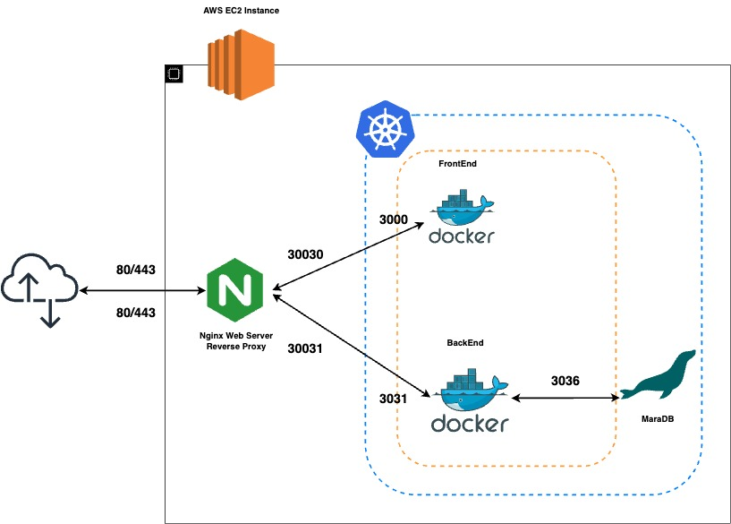
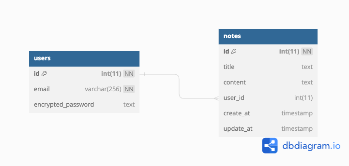

# 웹 기반 문서 편집기 제작 프로젝트
# 🔅 **프로젝트 소개**

### 핵심 키워드

### 요소기술
- Express, React, MariaDB
- JWT, Tiptap
###  개발/통합/테스트 도구
- GitHub, Docker/Kubernetes
- Jenkins, Terraform, Selenium
###  인프라 환경
- AWS EC2 + Minikube, Nginx AWS S3, AWS ECR
- Grafana + Slack

# ⚠️아키텍쳐

# 🏗️ERD
